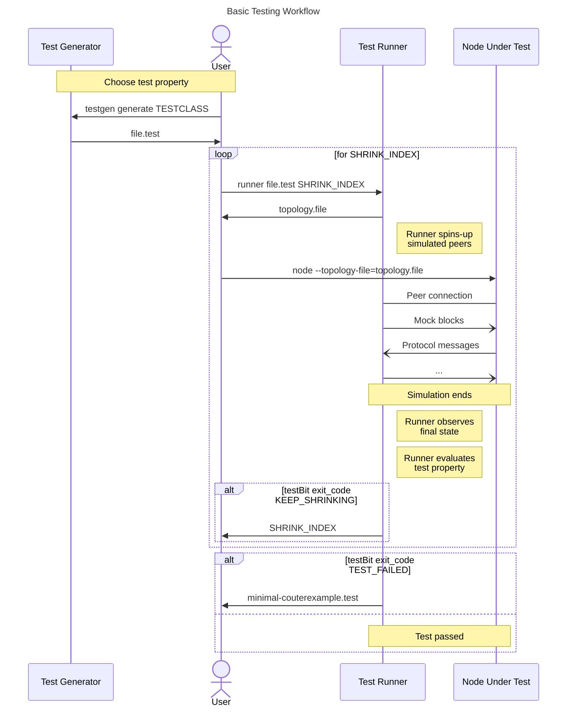

# Conformance Testing of Consensus Design Document

## Motivation

The eponymous feature of a consensus protocol is, of course, that it is expected
to maintain consensus. In our terms, all nodes (subject to the various
assumptions on the state of the network and honest majority) will agree on a
prefix of the current chain. Up to now, this has been achieved in the
following ways:

- Every node in the network is running (close to) the same code.
- Consensus testing (living inside [`io-sim`](https://hackage.haskell.org/package/io-sim),
  a Haskell IO simulator) validates that all (honest) nodes will eventually
  reach consensus.

In a world of multiple node implementations, this strategy no longer holds.
Nodes may be running very different code, and most of it will not be testable
under `io-sim`, used by `cardano-node` in a large suite of
*property tests*.[^prop] Given the subtlety in the implementation of the
consensus protocol, it's desirable that we can leverage this test suite to
help verify that alternate nodes have implemented the consensus protocol
stack correctly.

[^prop]: Property based testing (PBT) is a testing methodology where a big
  number of random unit tests are automatically generated against a property
  definition; that is, characteristics or invariants that the software under
  test must satisfy for all valid inputs. PBT frameworks often include a
  shrinking capability that attempts, in case of failure, to find the smallest
  or simplest counterexample to facilitate the diagnosis of bugs.

Correctness here is an *extremely important* property---much more so than in
most software projects. Nodes failing to agree on the correct chain risks an
accidental hard fork. Should one persist long enough the protocol  might be
unable to recover without external/etc intervention.

This document gives a design for a suite of tools, and the necessary
infrastructure changes, to expose these existing tests in a form that
alternative nodes can use.

We do not make any assumptions that alternative nodes be written in Haskell,
nor that they have access to a
[QuickCheck](https://en.wikipedia.org/wiki/QuickCheck)-like library.


## Context

The tests we'd like to expose to alternative implementations are in the "Node
vs Environment" style. In effect, while we are ultimately interested in the
behavior of multiple nodes agreeing on the "right" chain, we can more easily
test by taking advantage of two insights:

1. The logic of identifying the honest chain locally is tricky, but it is very
   easy to identify globally. Since we are only interested in cases where there
   is a global best chain, we have a very simple judgment rule as to whether
   a node has selected the correct one.
2. Once we have an easily identified honest chain, we no longer need to
   simulate multiple nodes and look for agreement - instead, we run only
   a single node and judge the correctness of its responses to stimuli.

The testing framework thus makes use of a single coordinated *point schedule,*
which is used to simulate multiple upstream (possibly adversarial, possibly
colluding) peers. After evaluation of the point schedule, the Node Under Test
(NUT) is validated to ensure it ends up with the correct chain.[^ps]

[^ps]: A "point schedule" is a set of tables, having one table per simulated
  peer, where each row on the table corresponds to a point in time and each
  column to a state variable (in order of update priority according to the
  current chain selection): the tip of the hypothetical chain selection, the most
  recent header that the peer should send to the NUT and the most recent block
  that the peer should send to the NUT. See the relevant documentation
  [here](https://github.com/IntersectMBO/ouroboros-consensus/blob/374ef153e20d83ad3d42d850ce560b67034ac578/ouroboros-consensus-diffusion/test/consensus-test/Test/Consensus/PointSchedule/SinglePeer.hs).

Whilst the point schedule currently is implemented inside the Haskell node's test suite, its
declarative nature makes it possible to export this testing method and make it
usable across diverse node implementations. To ensure this, we will look only
at the messages sent over the network, to ensure we are performing black-box
testing. It will also be possible for alternative nodes to use peer simulation
for white-box testing in cases that depend on internal tracing (eg. file
handles, memory usage, etc.). This suite of tools aims only at properties
related to test conformance against the Ouroboros Praos consensus protocol.
For example, that a node should always choose the longest of two competing
chains or that a rollback is triggered (or not) under specific conditions.


## Proposed Specification

### Desiderata

The design of the proposal is heavily influenced by our pursuit of the
following four desiderata:

1. **Composablity:** the resulting system ought to be built from small, individual
   pieces, which can be combined in different ways to accommodate different
   workflows. When in doubt, prefer small utilities over monolithic systems.
2. **Reusablity:** whenever possible, we should reuse existing machinery.
   If direct reuse is not possible, we will surgically modify existing code to
   support our new use cases.
3. **Congruence:** when given the same inputs, the system will return the same
   output (subject to the robustness of the NUT.) One particularly salient
   corollary of this is that the system must be *stateless.*
4. **Usefulness:** there is no reason to provide tests if they do not add any
   value. Therefore, the constraints necessary to run the tests must be
   minimal. The system must be automatable.


### Design

We will ship three separate CLI tools:

1. Test Generator (`testgen`)
2. Test Runner (`runner`)
3. Shrink Viewer (`shrinkview`)

The purpose of `testgen` is to generate test cases; it accepts arguments to
select a specific class of tests, and potentially some test-specific tuning knobs
(to eg, change the "difficulty" of the test.) Each class of tests will have an
associated Generator, which `testgen` will invoke to instantiate the test
class. Its output will be a *test file* containing a point schedule and a
(mechanical) description of the property which needs to pass.

The `runner` tool takes a test file (as output by `testgen`) as mandatory
argument, and an optional *shrink index* (see [shrinking](#shrinking)), to spin
up simulated peers corresponding to the embedded point schedule. The `runner`
tool will then output a
[topology
file](https://developers.cardano.org/docs/operate-a-stake-pool/node-operations/topology/)
whose `localRoots` point to the simulated peers and an additional
downstream peer whose sole job is to query the NUT state.[^query]

[^query]: Most properties in the referenced test suit depend exclusively on the
  final state of the NUT, so such a query could be made once after the point
  schedule completes. However, its plausible that querying the NUT state
  throughout the test run could allow implementing other properties if such
  repeated queries prove to be robust enough.

Alternative nodes which wish to test against `runner` need to parse the generated
topology file and connect to the simulated peers. Once they have all been
connected to, the point schedule will begin running. The simulated peers will
follow the point schedule, sending their mocked blocks to the NUT.

Who drives the *ticking* of the schedule remains an open question, dependent of
the trade-off between node implementation burden and testing time.
On the one hand, if the ticking is driven by the NUT, the simulated run can
be optimized for it. Alternatively, the ticking could be driven by the `runner`
itself, using tunable timeouts with defaults aiming to balance testing time
and node throughput.

Upon completion of the point schedule, we will evaluate the test property. We
can compare the final state of the NUT (as observed by the testing peer) and
ensure the desired property holds. Depending on the result of the test and the
state of the shrink index, we will perform different actions
(see [exit-codes](#exit-codes).)

It is important to note that a single invocation of the composition `runner
. testgen` corresponds to *a single unit test*. Users are encouraged to run this
composition in a loop, to gain the usual assurances given by property tests.

If a given test fails, and (further) shrinking is desired, users can rerun
`runner` with the outputted shrink index and the initial test file. The pair
`(testfile, shrinkindex)` is the entirety of the shrink search state.
By explicitly threading this state through flags and stdout, the system is
stateless.

A basic testing workflow would be like follows:

1. The user obtains a test file with an embedded point schedule from `testgen`.
2. The user invokes the `runner` binary, passing in the test file as an
   argument.
3. `runner` starts up the simulated peers, and returns a topology file.
4. The user starts its node with the given topology file.
5. The node connects to our simulated peers.
6. Once all of the peers have been connected to, the point schedule begins
   running.
7. After the point schedule has finished, we observe the final state of the node.
8. The `runner` will exit with a return code (see [exit-codes](#exit-codes))
   corresponding to whether or not the node ended in the correct state,
   producing either a shrink index for subsequent test run or a test file with
   a minimal counterexample.



The `shrinkview` tool accepts a test file and a shrink index, and outputs the
test file corresponding to the given shrink index. This tool is primarily
useful for looking at non-minimal test inputs, eg, when the user doesn't want
to iterate the shrinking all the way down to a minimal counterexample or desires
to keep file records of intermediate shrunk counterexamples.


#### Supported Operations and Flags

The **test generator** CLI tool supports, at least, the following operations:

- `list-classes` to list all available test classes.
- `generate` to produce a test file for a test class.
   This operation has the following optional flags:
   - `--seed` to specify a seed for the generator (eg to enable parallel
     workflows and reproducibility.)
   - `--size` to specify the target size of the point schedule (eg a desirable
     functionality for shrinking.)
- `meta` to access test class metadata, eg the number of `desired-passes`
  we expect to run a test for.

The **test runner** CLI tool takes a single test file as mandatory argument and
supports the following optional flags:

- `--shrink-index` to specify the shrunk point schedule to run, according to the
  given index. The index values are output by the `runner` itself.
- `--topology-file` specifies the output path for the topology file.
- `--minimal-test-output` specifies a file path to write the last counterexample
  test file to if no further shrinking is possible. This is the only case
  `runner` outputs a test file. Non-minimal counterexample test files can be
  produced by using `shrinkview`.

The **shrink viewer** tool has two mandatory arguments (a test file and a shrink
index), a single mode of operation, and no flags.

These operations provide the primitives needed to orchestrate a QuickCheck-like
workflow. For example, users are free to run the entire test suite by looping
over the output of `testgen list-classes`.


#### Exit Codes

The `Exit` bit mask enum is used in the following section:

```c
enum Exit {
  SUCCESS = 0,
  INTERNAL_ERROR = 1,
  BAD_USAGE = 2,
  TEST_FAILED = 4,
  CONTINUE_SHRINKING = 8,
}
```

In the case that the property succeeded and the shrink index is `empty`, we
will exit with code `SUCCESS`. This corresponds to a test pass.

`INTERNAL_ERROR` is for when something goes wrong inside of `runner` itself,
and `BAD_USAGE` is for when the program is invoked incorrectly (eg called with
unparsable flags.) This usage of codes 1 and 2 is consistent with POSIX
standards.

If the property succeeded, but the shrink index was non-`empty`, we will exit
with code `CONTINUE_SHRINKING`. In addition, we will output the result of `succ
shrinkIndex` (the successive shrink branch) on stdout; if this operation fails,
we deem  the `parent shrinkIndex` case a minimal counterexample and output it
to stdout. While both cases are technically a test pass, they are a pass for
a shrunk input. Thus we regard them as merely a "local" success, rather than
"global" success.

If the property failed, and we can `extend` the shrink index, we will exit with
code `TEST_FAILED | CONTINUE_SHRINKING` and output the result of `extend shrinkInput`
on stdout. This corresponds to a non-minimal test failure.

If the property failed and we cannot `extend` the shrink index, we will exit
with code `TEST_FAILED`, and produce the minimal test case on stdout.

When the `CONTINUE_SHRINKING` bit is set in the exit code, the user can
rerun the `runner` with the new shrink index, in order to continuing searching
for smaller counterexamples.


## Alternatives

- Make `runner` automatically generate the next shrinking candidate (point
schedule) and ask the client to run it, instead of just passing a shrink index
for her to use in a subsequent test run or produce the point schedule herself
if needed using `shrinkview`, as is our proposed design.
This is a viable alternative, as we want all our components to be stateless as
a design choice for composability. In fact, our original design does not
preclude the possibility of implementing this.


## Unresolved Questions

* Do we need a separate peer to act as our state observer? Maybe not, but it's
  conceptually clearer to have a peer whose sole job is to collect data.
  For example, in the case of an empty peer schedule it is clear that the
  downstream peer would still get the correct state.

## Implementation Plan

As things stand, each test property is implicit within calls to
`forAllGenesisTest`. In order to expose the existing test suite to our
`testgen` and `runner` tools, we propose reifying each test property as
an instance of a `ConsensusTest` data type, which are arranged into a
`TestSuite` data structure.

<a name="testsuite-anchor"></a>
```haskell
data TestClass

data TestSuite a
instance Semigroup (TestSuite a)
instance Monoid (TestSuite a)

insert :: TestClass -> a -> TestSuite a -> TestSuite a
toListWithKey :: TestSuite a -> [(TestClass, a)]


data ConsensusTest = ConsensusTest
  { generator :: Gen PointSchedule
  , shrinker :: PointSchedule -> [PointSchedule]
  , property :: PointSchedule -> IO Bool
  , desiredPasses :: Int
  }

allTheTests :: TestSuite ConsensusTest

runConsensusTest :: ConsensusTest -> Property
```

The change to `cardano-node`'s test suite would be minimal, and it essentially boils
down to implementing `runConsensusTest` using `forAllGenesisTest`, which should
have no local effect on the implementation. Along these lines,
`toTasty :: TestSuite ConsensusTest -> TestTree` would essentially traverse the
`TestSuite` using `runConsensusTest`.


## Milestones


### Milestone 1 - Run Point Schedules and Property Tests for `cardano-node`

#### Goal

The goal of milestone 1 is to de-risk the project implementation. We will
provide an extremely bare-bones minimum viable product (MVP) which illustrates
that the major engineering hurdles can be solved and that our approach is
feasible.

To that end, we will deliver a version of `runner` which can perform
black-box testing of (a fork of) `cardano-node` against a given point schedule.

The test executable will communicate with `cardano-node` over network sockets,
and will not use any specialized knowledge of the internals of `cardano-node`.
As a possible exception, we will assume that we can run `cardano-node` over
`TestBlock`s. This might require a fork.

We'll start with a simple testing approach, where we compare the resulting
state of the NUT with the end state of the point schedule and make sure
the simulated peers behave as expected. While we **will not support arbitrary
properties at this point**, testing will be run for both a positive and
a negative property so that both code paths (success and failure) are
consistently tested during development.


#### Deliverables

In this milestone, we will deliver a minimal implementation of `runner`,
supporting:

- (bare-bones) parsing of point schedule test files
- generating topology files
- running point schedules
- observing the state of the NUT
- returning an appropriate error code among `SUCCESS`, `INTERNAL_ERROR`,
  `BAD_USAGE` or `TEST_FAILED`

We explicitly *will not* implement anything around generators or shrinking in
milestone 1. We assume point schedules can be obtained somehow, but we will
require only enough in the way of point schedules to verify that our approach
does what it ought.


### Milestone 2 - Shrinking

#### Goals

Provide a useful failure feedback, so that users can leverage the test
to find specific bugs on their consensus protocol implementation.

Deliver a shrinking strategy to run our executable from Milestone 1 on subsequently
smaller tests.


#### Deliverables

In this milestone, we will implement the shrinking functionality. In particular,
we will make the following changes to `runner`:

- Parse an optional `--shrink-index` flag
- Parse an optional `--minimal-test-output` flag
- Upon `TEST_FAILED`, try `extend`ing the shrink index. If extension is
  possible, emit the new shrink index on stdout and return
  `TEST_FAILED | CONTINUE_SHRINKING`. If extension is not possible and
  `--minimal-test-output` was set, write the minimal test case out to this
  filepath.
- Upon `SUCCESS`, if `--shrink-index` was passed in, emit the result of `succ
  shrinkIndex` on stdout, and return `SUCCESS | CONTINUE_SHRINKING`.

In addition, we will deliver property tests ensuring that `ShrinkIndex`, `succ`,
and `extend` correctly explore a shrink tree.

We will also implement the `shrinkview` binary at this time, which accepts only
a test file and shrink index, and outputs the shrunk test on stdout.


### Milestone 3 - Amaru and other Implementations

#### Goal

At this point, the MVP is working as expected on the `cardano-node`; our goal
now is to ensure this works for other implementations, and that our design is
decoupled from any internal details of `cardano-node`.

The central step in this milestone will be a consultation with the
[Amaru](https://github.com/pragma-org/amaru) architects
to explain out the design to them and discuss any concerns about satisfying the
proposed interface, which *a priori* consists of configurable options to disable
cryptography, change timeouts, and parse topology files.

#### Deliverables

In this milestone we will deliver an updated version of `runner` that uses
cardano blocks instead of `TestBlock`s, which are exclusive to `cardano-node`
testing infrastructure.

Furthermore, we will deliver a design update integrating the feedback from
the Amaru architects, including a high-level overview and analysis of the
configurable options necessary for *any* implementation to test against
our harness.

We explicitly aim for insight into the expected *implementation burden*
required on alternative nodes.

#### Questions to Answer

Do we need to simulate time? This might be related to configuration access to
node timeouts (as network latency would be irrelevant in this setting).


### Milestone 4 - Implement `testgen`

#### Goal

Now that we have a proven design and working system, we can commit to making
the approach official. We will refactor the existing test suite into a reified
[`TestSuite`](#testsuite-anchor), from which we can extract both the existing
`tasty` test suite, as well as the data for `testgen`.

This step will require patching `ouroboros-consensus`'s test suite, which is why we want to
have proven the technology before making upstream changes.


#### Deliverables

In this milestone, we will deliver:

1. a design and specification of the serialization format for our test files
2. corresponding changes to `runner` and `shrinkview` for parsing and
   serializing these files
3. we will port all of the existing `ouroboros-consensus` tests into a reified
   [`TestSuite`](#testsuite-anchor) representation.

In addition, we will deliver the `testgen` utility, including:

1. support for the `generate` command, including selection of test class,
   optional seed and optional size parameters.
2. support for the `list-classes`  command
3. support for the `meta desired-passes` command


#### Questions

- Can `ouroboros-consensus:consensus-tests` remain as the canonical place for
  this data? Is it possible for our app to depend directly on the test suite of
  another library? We might need to do some cabal shuffling here.


### Milestone 6 - UX Improvement

#### Goals

At this point the harness is working and usable. However, it has been built with
composability in mind. In this milestone we will work on building reusable tools
for common workflows.


#### Deliverables

- We will provide a tool that will automatically run the shrinking loop --- run
  test, and rerun if `CONTINUE_SHRINKING` is masked into the exit.
- We will provide a tool to run the entire test suite against a node. It will
  run each test the `desiredPasses` number of times, but not perform shrinking.


#### Questions

What other things can we do to improve the usability of these tools?
