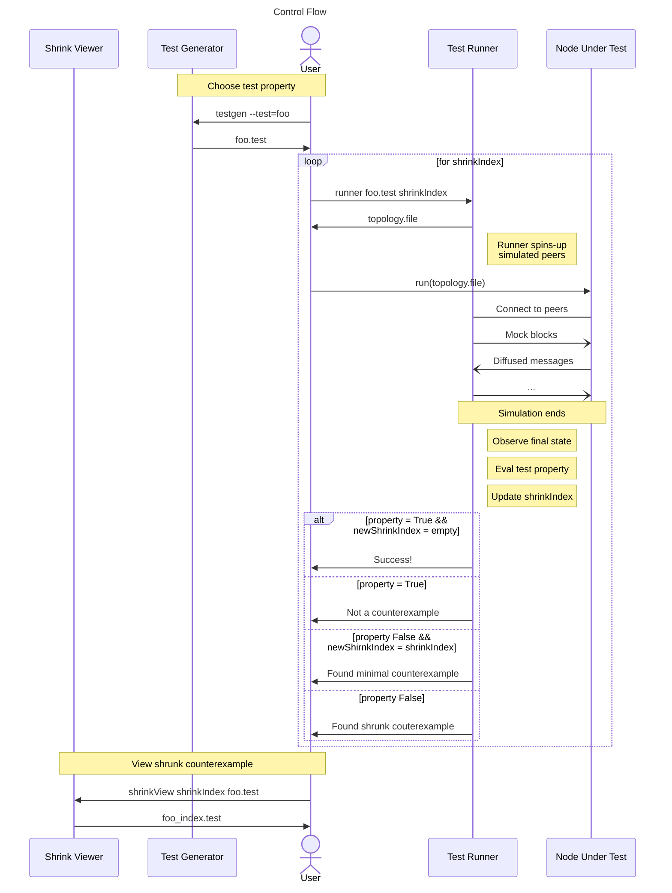

# CTC Design Diagrams

```mermaid
---
title: Control Flow
---
sequenceDiagram
  participant SV as Shrink Viewer
  participant PSG as Test Generator
  actor User
  participant Runner as Test Runner
  participant NUT as Node Under Test

  Note over User,PSG: Choose test property
  User ->> PSG: testgen --test=foo
  PSG ->> User: foo.test

  loop for shrinkIndex

    User ->> Runner: runner foo.test shrinkIndex
    Runner ->> User: topology.file
    Note right of Runner:Runner spins-up<br/>simulated peers
    User ->> NUT: run(topology.file)

    NUT -> Runner: Connect to peers
    Runner -) NUT: Mock blocks
    NUT -) Runner: Diffused messages
    Runner -) NUT: ...
    Note over Runner,NUT: Simulation ends

    Note right of Runner: Observe final state
    Note right of Runner: Eval test property
    Note right of Runner: Update shrinkIndex

  alt property = True && newShrinkIndex = empty
    Runner ->> User: Success!
  else property = True
    Runner ->> User: Not a counterexample
  else property False && newShirnkIndex = shrinkIndex
    Runner ->> User: Found minimal counterexample
  else property False
    Runner ->> User: Found shrunk couterexample
  end

  end

  Note over SV,User: View shrunk counterexample
  User ->> SV: shrinkView shrinkIndex foo.test
  SV ->> User: foo_index.test
```
