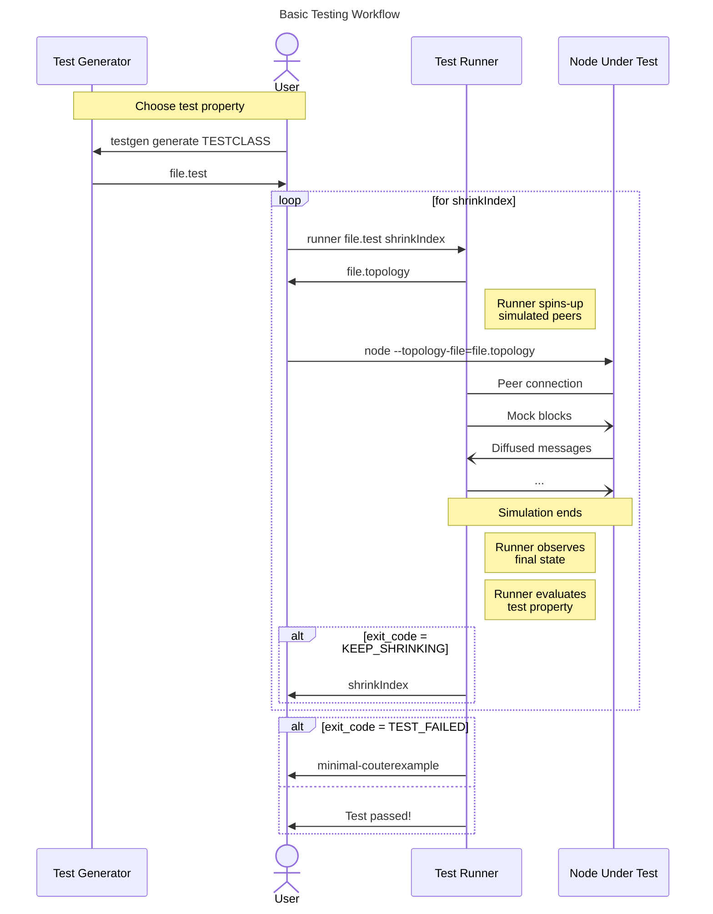
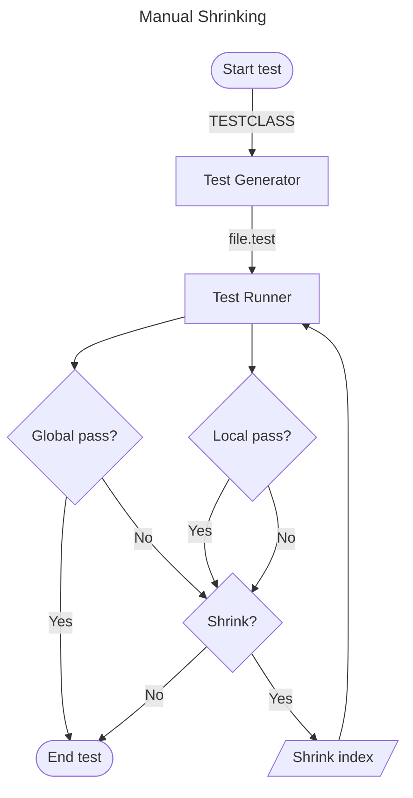

# CTC Design Diagrams

```mermaid
---
title: Basic Testing Workflow
---
sequenceDiagram

  participant PSG as Test Generator
  actor User
  participant Runner as Test Runner
  participant NUT as Node Under Test

  Note over User,PSG: Choose test property
  User ->> PSG: testgen generate TESTCLASS
  PSG ->> User: file.test

  loop for shrinkIndex

    User ->> Runner: runner file.test shrinkIndex
    Runner ->> User: file.topology
    Note right of Runner: Runner spins-up<br/>simulated peers
    User ->> NUT: node --topology-file=file.topology

    NUT -> Runner: Peer connection
    Runner -) NUT: Mock blocks
    NUT -) Runner: Diffused messages
    Runner -) NUT: ...
    Note over Runner,NUT: Simulation ends

    Note right of Runner: Runner observes<br/>final state
    Note right of Runner: Runner evaluates<br/>test property

  alt exit_code = KEEP_SHRINKING
    Runner ->> User: shrinkIndex

  end

  end

  alt exit_code = TEST_FAILED
    Runner ->> User: minimal-couterexample
  else
    Runner ->> User: Test passed!
  end
```

```mermaid
---
title: Manual Shrinking
---
flowchart TD
  start([Start test])
  runner[Test Runner]
  result{Global pass?}
  resultL{Local pass?}
  shrink{Shrink?}
  generator[Test Generator]
  index[/Shrink index/]
  finish([End test])

  start -- TESTCLASS --> generator
  generator -- file.test --> runner
  runner --> result
  result -- No --> shrink
  result -- Yes --> finish
  shrink -- No --> finish
  shrink -- Yes --> index
  runner --> resultL
  resultL -- Yes --> shrink
  resultL -- No --> shrink
  index --> runner
```
